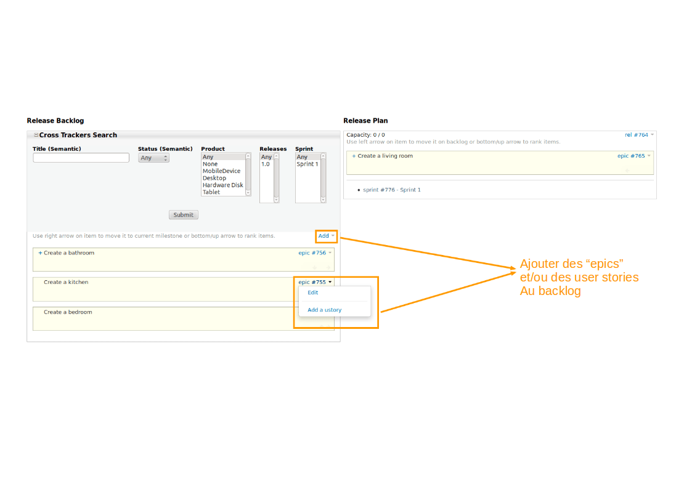

.. |SYSPRODUCTNAME| replace:: Tuleap

.. _agile-dashboard:

Agile Dashboard
===============

L'Agile Dashboard de |SYSPRODUCTNAME|  est un nouveau service basé sur les trackers (see :ref:`trackers-and-real-time-reports`).
Il s'adapte à la plupart des équipes agile.

Features
--------

L' Agile Dashboard de |SYSPRODUCTNAME| comporte de nombreuses fonctionnalités, dont un cardwall, un burndown ainsi
qu'un outil de planification et de gestion des différents backlogs.

Le cardwall permet de gérer les tâches au quotidien, d'avoir un aperçu des personnes travaillant sur ces dernières et de
connaître l'effort restant.
Le burndown offre une représentation graphique du reste à faire tout au long d'un sprint.
L'outil de planification et de gestion du backlog permet d'organiser les différents backlogs.


Création d'un Agile Dashboard
---------------------------

Création à partir d'un template de |SYSPRODUCTNAME|
```````````````````````````````````````````````````
Etant donné les nombreuses configurations pour mettre en place un agile dashboard, nous vous conseillons d'importer un
template puis de l'adapter aux besoins de votre équipe.

En premier lieu, les plugins "tracker" et "agile dashboard" doivent être installés et activés sur votre projet.

Importer un agile dashboard n'est actuellement possible qu'en ligne de commande.
Assurez vous d'avoir les accès nécessaires au répertoire sur lequel |SYSPRODUCTNAME| est installé.

Un template "Agile Dashboard" est téléchargeable ici : https://tuleap.net/plugins/docman/?group_id=101&action=show&id=438

Imaginons que vous souhaitiez importer ce template dans un projet vide ayant pour un group_id = 123.

::

    $> cd /usr/share/codendi/
    $> src/utils/php-launcher.sh src/utils/import_project_xml.php 123 admin /path/to/agiledashboard_template.xml

    Notez que "admin" correspond à un utilisateur qui doit être administrateur du site.

De nouveaux trackers et un agile dashboard configuré sont crées dans le projet dont l'id est 123.

Dupliquer un Agile Dashboard existant
`````````````````````````````````````
Un Agile Dashboard peut être copié d'un projet à un autre.
Pour ce faire, vous devez exporter celui que vous souhaitez copier à la manière de l'import.

Imaginons que vous souhaitiez exporter un agile dashboard dont le projet a pour group_id = 456.

::

    $> cd /usr/share/codendi/
    $> src/utils/php-launcher.sh src/utils/export_project_xml.php 456 > my_agiledashboard_template.xml

Un fichier xml contenant toutes les données nécessaires devrait être créé. Vous pouvez l'utiliser pour l'import
(cf. Création à partir d'un template).

Création d'un agile dashboard sans template
```````````````````````````````````````````

Si vous ne souhaitez pas partir d'un template, une vidéo expliquant toutes les étapes  est diponible en anglais.

.. raw:: html

   <iframe width="560" height="315" src="http://www.youtube.com/embed/sypv1C_yY_o" frameborder="0" allowfullscreen></iframe>


Notez que la dénomination de certains champs doit être respectée :

-  Effort restant : le field_name du champ représentant l'effort restant (utilisé dans les user stories et les tâches)
doit être "remaining_effort"
-  Impediment/Obstacle : le field_name du champ représentant un obstacle à la réalisation d'une tâche, par exemple,
doit être "impediment",
afin d'être affiché sur les cartes.
-  Date de début d'un sprint : le field_name du champ représentant la date début doit être "start_date"
-  Capacité d'un sprint : le field_name du champ représentant la capacité doit être "capacity"
-  Durée d'un sprint : le field_name du champ représentant la durée doit être "duration"
-  Type de la tâche: the field_name représentant le type doit être "type" et être une select box dont les valeurs doivent
avoir un decorateur. Ceci permettra d'afficher une couleur représentant le type de chaque carte, par exemple, une couleur
bleu sera affichée sur le côté de la carte s'il s'agit d'une tâche de Développement, ou vert s'il s'agit d'une tâche de Test.

Notez que le champ burndown peut⁻être configuré pour inclure ou non les week-ends, les samedis et dimanches seront exclus du burndown.

Utiliser un Agile Dashboard
---------------------------
Pour accéder au service "Agile Dashboard" d'un projet, allez sur la page d'accueil d'un projet (cf :ref:`accessing-a-project-dashboard`)
et cliquez sur "Agile Dashboard" dans la barre des services.

Vous serez dirigé sur la page d'accueil de l'agile dashboard de votre projet (see `Agile Dashboard Homepage`_).

La page d'accueil est composée de raccourcis vers les 5 derniers items de chaque "planning" défini, par exemple, le planning des Sprints
et celui des Releases.

La page d'accueil fournit aussi le cardwall du dernier sprint. L'équipe agile peut ainsi directement faire ses changements
sur cette page lors de la mélée quotidienne.


   Agile Dashboard Homepage

.. _plan-releases-and-sprints:

Planifier des releases and des sprints
``````````````````````````````````````
Pour créer une nouvelle release ou un nouveau sprint, cliquez sur la flèche dans les boîtes
To create a new release or a new sprint, click on the arrow in the short access box (see `Create a new release or a new sprint`_).

You will reach the release tracker form to create a new release.


   Agile Dashboard: Create a new release or a new sprint

Once created, you will be redirected to the release backlog in order to plan your release (see `Plan a release`_).

The Agile Dashboard lets you add easily epics, for instance, from your backlog (on the left side) to your release plan (on the right side).

Epics can also be splitted into user stories by clicking to the arrow next to the epic id.


   Agile Dashboard: Plan a release

From the release planning view, you can either create new sprints or access the existing ones.

Plan a sprint (see `Plan a sprint`_) is as simple as the release plan.

User stories can be added using the right arrow to move it from the release backlog to the sprint.

Moreover, a red indicator is automatically displayed when the capacity exceeds of the team capacity for the sprint.

Splitting user stories in tasks is also possible directly from the sprint planning.

Using the arrow next to story provides you a direct link to create a new task, but also lets you edit your story.

.. figure:: ../images/screenshots/sc_agiledashboard_sprint_plan.png
   :align: center
   :alt: Plan a sprint
   :name: Plan a sprint
   :width: 800px

   Agile Dashboard: Plan a sprint

Populate backlog
````````````````
A product owner can populate the backlog either going directly to the "Epics" and "User Stories" trackers or using the
Agile Dashboard.

To populate backlog using the agile dashboard, one release, at least, would have to be defined (see :ref:`plan-releases-and-sprints`).

Then access to the backlog by using the short access boxes available in the Agile Dashboard Homepage.
(see `Access to the Backlog`_).


   Agile Dashboard: Access to the Backlog

Then on the release backlog part on the left, click on "add" to add new epics to the backlog, or click on an epic to add
a user story to it (see `Populate the Backlog`_).



   Agile Dashboard: Populate the Backlog

The agile dashboard also provides the possibility to prioritize the backlog, by using the bottom and up arrows on your
elements (see `Rank the Backlog elements`_).


   Agile Dashboard: Rank the Backlog elements

Monitor project progress
````````````````````````
By any moment of the sprint, the development team can monitor and update the progress of the sprint by going to the cardwall and the burndown.

The latest sprint cardwall is available directly from the agile dashboard homepage or the short access boxes.

The cardwall (see `Cardwall`_) lets the development team manipulates the cards with drag'n drop to change their status, or assign the tasks
and change the remaining effort on the fly, that is to say staying on the same page.

The team can configure the display of the assignement by choosing between the display of the username or the avatar.

This configuration will be the same for all the sprints, but can be changed at any moment thanks to the "Settings"
select box on the right.

Finally, it offers the possibility to filter the cards thanks to the search at the top right of the cardwall. You will be able to filter by
assignee for instance, or by the type of tracker (display only the tasks or only the user stories).


   Agile Dashboard: Cardwall

The team can follow the progress of the sprint by accessing the burndown via the homepage's short access boxes (see `Short Access boxes`_) or the "Burndown" tab.

The burndown graph is automatically generated depending on the remaining effort of the tasks the team update everyday.


   Agile Dashboard: Short Access boxes

Training Video
``````````````
Here is a training video explaining how to use the agile dashboard.

.. raw:: html

   <iframe width="560" height="315" src="http://www.youtube.com/embed/wAJ_MosYgAM" frameborder="0" allowfullscreen></iframe>

