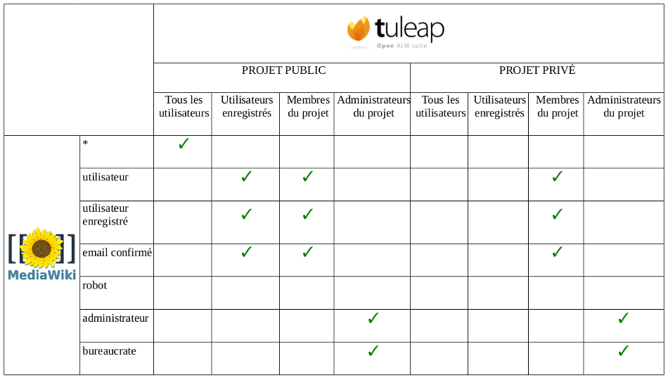

.. _mediawiki:

Mediawiki
=========

Vue d'ensemble
--------------

Ce chapitre n'est pas un tutoriel Mediawiki. Il se concentre sur l'intégration de Mediawiki
dans Tuleap. Si vous n'êtes pas familier avec Mediawiki, nous vous recommandons de lire la documentation
proposée dans la partie référence (see `Références pour Mediawiki`_).

Mediawiki est proposé dans sa version 1.20 avec Tuleap. Actuellement, ce Mediawiki n'est déployé avec aucun
module complémentaire.

Il y'a une instance de Mediawiki par projet dans Tuleap. Tuleap gère la connexion des utilisateurs dans Mediawiki.
Un utilisateur de Tuleap a accès à Mediawiki dans l'ensemble des projets auxquels il peut accéder
(et qui ont activé le service Mediawiki). Par conséquent, vous n'avez pas à vous enregistrer sur Mediawiki.

Les utilisateurs dits "restreints" auront accès à Mediawiki dans l'ensemble des projets où ils sont membres.
S'ils ne le sont pas, ils ne seront pas autorisés à accéder à Mediawiki, que ça soit dans les projets privés
et publics.

Gestion des permissions
------------------------

Correspondance entre les goupes Tuleap et Mediawiki
```````````````````````````````````````````````````

Il existe une correspondance entre les groupes d'utilisateurs Tuleap et Mediawiki.

Un utilisateur ajouté dans un groupe Tuleap sera intégré automatiquement dans le groupe
Mediawiki correspondant. Par exemple, en ajoutant un utilisateur dans votre projet, il sera automatiquement
ajouté dans les goupes utilisateurs, email confirmé et utilisateurs enregistrés. Ceci est totalement
transparent pour les utilisateurs et les administrateurs de projet.

Il n'est dorénavant plus possible d'ajouter un utilisateur
directement dans un groupe Mediawiki.

Actuellement, il n'existe pas de moyen pour créer une correspondance personnalisée entre les groupes.
La correspondance définie par Tuleap est la suivante : 



Synchronisation des utilisateurs et de groupes pour Mediawiki
`````````````````````````````````````````````````````````````

Dans le but d'avoir des utilisateurs et des groupes dans Mediawiki les plus pertinents possibles,
une synchronisation est lancée lorsque les actions suivantes se produisent :

-  Un utilisateur Tuleap n'est plus membre de projet

-  Un utilisateur Tuleap n'est plus administrateur de projet

-  Un utilisateur Tuleap est renommé


Mediawiki extensions
--------------------
Tuleap a intégré les extensions Mediawiki suivantes :
-  SyntaxHighlight_GeSHi (http://www.mediawiki.org/wiki/Extension:SyntaxHighlight_GeSHi): cette extension permet d'afficher du code source formaté.

-  PdfBook (http://www.mediawiki.org/wiki/Extension:PdfBook): cette extension permet de composer un ensemble d'articles d'une catégorie et de l'exporter au format pdf.

-  ParserFunctions (http://www.mediawiki.org/wiki/Extension:ParserFunctions): cette extension améliore l'analyseur de wiki avec des fonctions principalement liés à la logique et la manipulation de chaîne de caractères.

-  WikiEditor (http://www.mediawiki.org/wiki/Extension:WikiEditor): cette extension offre un éditeur de texte. Elle est seulement disponible avec l'affichage en mode compatibilité.


Affichage en mode compatibilité
-------------------------------

Afin de permettre l'utilisation des plugins mediawiki qui produisent des conflits d'affichage au sein de Tuleap, il y a une option
de passer en mode compatibilité. Si choisie et si les administrateurs de la forge l'ont activée, cette option passe l'affichage du
mediawiki du projet en mode "par défaut". Néanmoins, on reste toujours au sein de son projet et des liens pour y revenir se trouvent
sur la barre de gauche.

Références pour Mediawiki
-------------------------

-  Documentation officielle de Mediawiki : http://www.mediawiki.org/wiki/Documentation/fr

-  Mediawiki, droits d'accès par défaut : http://www.mediawiki.org/wiki/Manual:User_rights/fr
